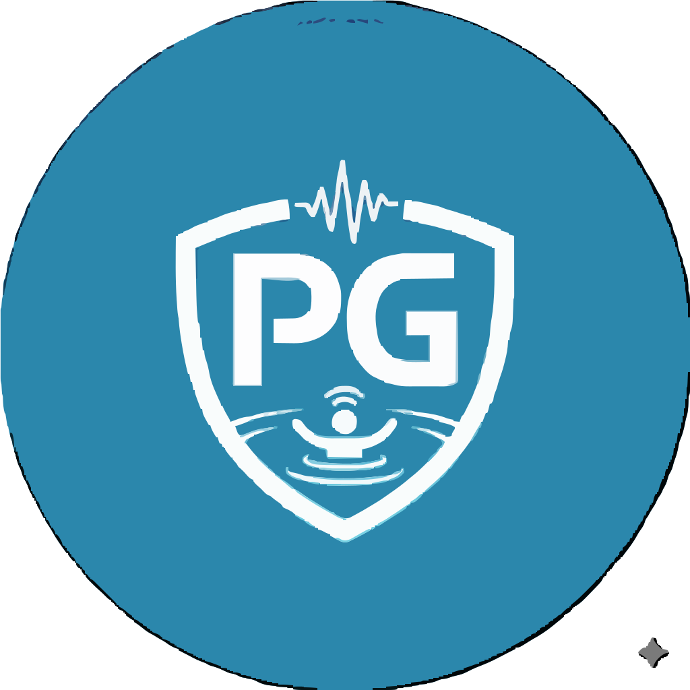

<p align="center">
  
</p>

# PoolGuard

A real-time aquatic safety and automated drowning prevention platform.

---

## Overview

PoolGuard is an enterprise aquatic safety system designed to provide continuous, automated surveillance for commercial and residential swimming facilities. By monitoring multi-person activity across live video streams, PoolGuard rapidly detects distress behaviors and potential drowning incidents, enabling immediate intervention before emergencies escalate.

Traditional lifeguard operations rely entirely on manual visual monitoring, which can suffer from visual fatigue, blind spots, and delayed reaction times during high-occupancy conditions. PoolGuard operates as an intelligent safety layer that continuously analyzes swimmer dynamics, tracks individuals across complex environments, and dispatches automated alerts to onsite response personnel.

---

## Features

- **Real-Time Aquatic Surveillance**: Continuous monitoring of pool areas with sub-second alert generation for immediate emergency response.
- **Multi-Person Tracking**: Simultaneous monitoring of multiple swimmers in dense aquatic environments without loss of tracking integrity.
- **Behavior & Distress Analysis**: Advanced motion evaluation designed to distinguish normal swimming activities from critical drowning distress patterns.
- **Automated Alert Dispatch**: Multi-channel notification pipeline delivering real-time emergency alerts directly to safety teams.
- **Role-Based Access Control**: Granular access management tailored for facility managers, safety operators, and platform administrators.
- **Secure Authentication & Oversight**: Enterprise-grade access protections featuring single-session enforcement and structured operation logs.
- **Flexible Stream Ingestion**: Support for multiple video feed inputs including direct hardware feeds and remote video channels.
- **Live Monitoring Dashboard**: High-definition, low-latency visual interface providing clear safety status indicators for all active swimmer feeds.

---

## Getting Started

Follow these steps to set up PoolGuard locally for development and testing.

### Prerequisites

- Recommended runtime environment installed on host system
- Package manager configured for dependency installation

### Installation

1. **Clone the repository**

   ```bash
   git clone https://github.com/organization/poolguard.git
   cd poolguard
   ```

2. **Install dependencies**

   ```bash
   npm install
   ```

3. **Start the application**

   ```bash
   npm run dev
   ```

---

## Usage

PoolGuard provides a streamlined product workflow designed for facility safety personnel and administrators:

1. **Authentication**: Log into the secure operations portal using assigned staff credentials.
2. **Feed Configuration**: Connect facility camera streams or upload sample footage for safety evaluation.
3. **Surveillance Launch**: Initiate real-time aquatic monitoring through the central dashboard interface.
4. **Safety Oversight**: Monitor live visual indicators representing swimmer states and active safety metrics.
5. **Alert Response**: Receive instant visual and auditory notifications when potential distress conditions are identified, directing guards to exact locations.
6. **System Management**: Manage user permissions, active monitoring sessions, and historical safety incident logs from the administrative console.

---

## Screenshots

### Landing Page

(Add screenshot here)

### Live Surveillance Dashboard

(Add screenshot here)

### Incident & Alert Monitor

(Add screenshot here)

---

## Contributing

We welcome contributions from the community to improve PoolGuard's capabilities.

1. Fork the repository
2. Create a feature branch (`git checkout -b feature/improvement`)
3. Commit your changes (`git commit -m 'Add new feature'`)
4. Push to the branch (`git checkout -b feature/improvement`)
5. Open a Pull Request for code review

---

## License

Distributed under the MIT License. See `LICENSE` for more information.

---

## Support

For technical questions, feature requests, or bug reports:

- Open an issue in the GitHub Issues section.
- Start a conversation on GitHub Discussions.
- Contact the maintainers directly for facility enterprise deployments.

---

## Acknowledgements

- Facilities and safety professionals providing domain insight into aquatic monitoring.
- The open-source community for foundational tools and libraries enabling modern web platforms.
